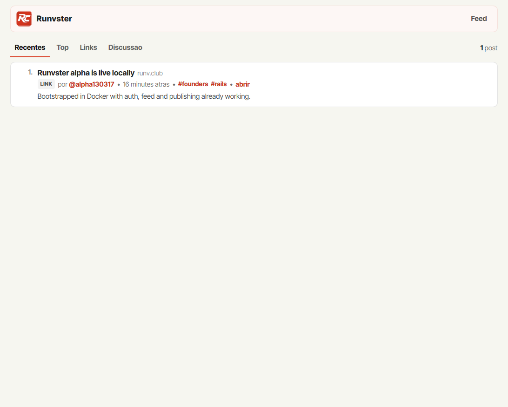

# Runvster



Runvster is a small community platform for links and discussion.

## Stack

- Rails 8
- PostgreSQL
- Redis
- Solid Queue
- Docker Compose

## Local

```bash
docker compose up --build
```

App:

- [http://localhost:3000](http://localhost:3000)

Mail:

- [http://localhost:8025](http://localhost:8025)

Login:

- [http://localhost:3000/login](http://localhost:3000/login)

## Docs

- [docs/README.md](docs/README.md)
